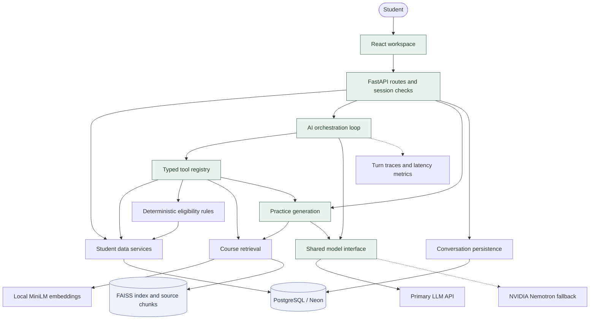
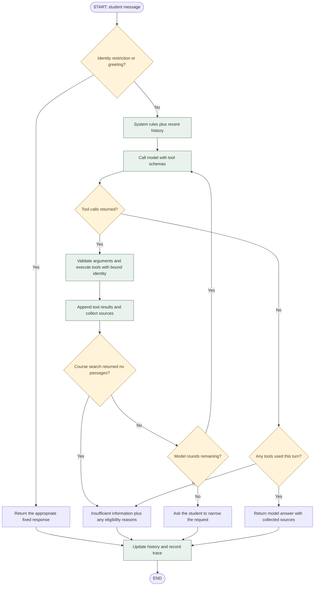
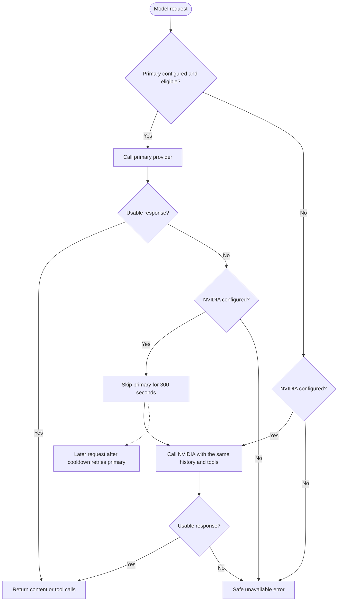
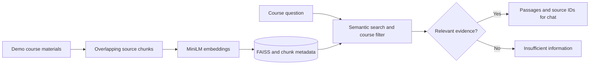
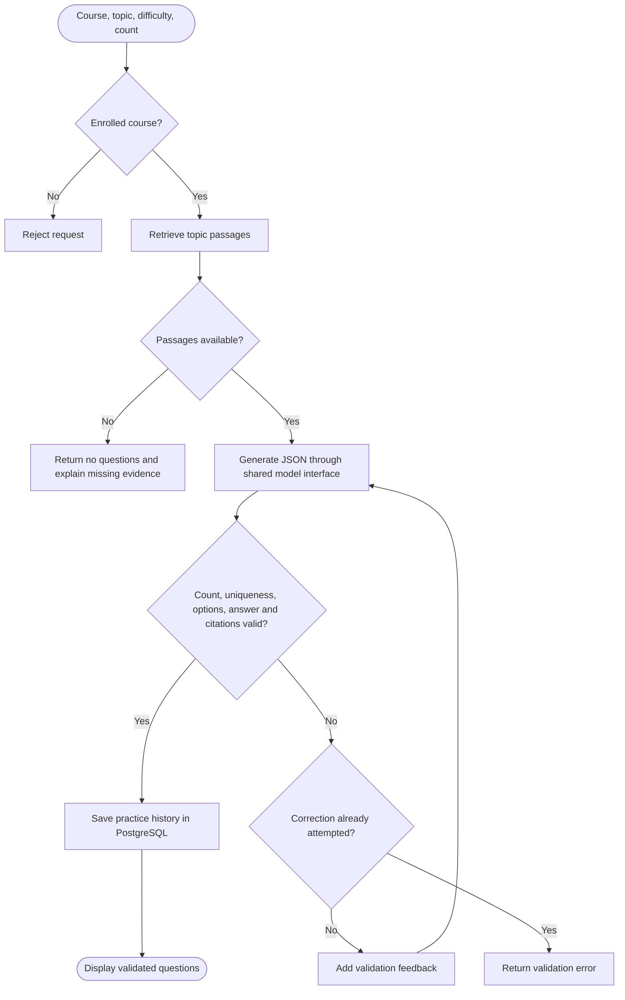

# Orbit

### Find your focus. Build your momentum.

Orbit is a college learning workspace combining student progress, course-grounded AI chat, assessment eligibility, and practice. It turns supplied learning records into useful next steps while keeping identity, data access, and assessment decisions under backend control.

[Get started](GET_STARTED.md) · [Deployment](docs/DEPLOYMENT.md) · [Data and demo assumptions](docs/ARCHITECTURE.md)

## The learning workspace

| Experience | What Orbit provides |
| --- | --- |
| Student selection | Demo profiles drawn from supplied student records |
| Dashboard | Course progress, performance, weak topics, and assessment history |
| AI chat | Multi-step tool use, course references, and persistent conversations |
| Eligibility | Deterministic decisions with reasons and unmet requirements |
| Practice | Course-grounded questions with validated options, answers, and citations |
| Provider resilience | Primary LLM with automatic NVIDIA fallback and recovery cooldown |

## System architecture

The LLM selects tools and narrates their outputs. Typed services query the database, Python computes eligibility, and retrieval supplies course passages. The model has no direct database connection.

## AI flow: a LangGraph-style view

Nodes, conditional routing, and a tool loop describe the existing implementation. Orbit implements this flow in async Python; **LangGraph and LangChain are not runtime dependencies**.

A turn carries messages, tool results, source references, and a trace. The backend binds student identity before executing tools. Chat retains the latest 20 history messages and permits six model rounds, with at most eight tool calls per response.

Missing retrieval evidence stops further course-content generation. System instructions treat tool outputs and retrieved text as untrusted data. Citations and tool-use checks support grounded answers; they do not formally verify every generated claim.

## Model fallback and recovery

Chat and practice share a model interface. NVIDIA defaults to `nvidia/nemotron-3-nano-30b-a3b`, with thinking disabled for lower latency. `nvidia/nemotron-3-super-120b-a12b` is an optional model setting.

With fallback enabled, quota errors, rejected access, HTTP failures, timeouts, and unusable responses trigger failover. Each provider call has a default 30-second total budget. Without NVIDIA, the primary retains bounded rate-limit retries before returning an error. Cooldown state is process-local, and both providers can still become unavailable.

## Course retrieval

Demo-authored materials are split into overlapping chunks, embedded locally with `all-MiniLM-L6-v2`, and stored in FAISS with source and course metadata. Search filters by course and similarity threshold before returning evidence.

## Validated practice generation

Known catalog topics use direct passage lookup, with semantic search as a fallback. Generated questions pass schema and citation checks before being saved or displayed.

## Technology stack

| Layer | Technologies | Role |
| --- | --- | --- |
| Interface | React 19, React Router 7, Vite 6, CSS, Lucide | Responsive workspace and navigation |
| Chat rendering | React Markdown, remark-gfm | Markdown answers and tables |
| API | Python 3.13, FastAPI, Uvicorn, Pydantic | Routes, validation, sessions, and error handling |
| Data | PostgreSQL / Neon, SQLAlchemy, Psycopg | Student records, conversations, practice history |
| AI orchestration | Async Python, HTTPX | Tool loop, provider adapters, timeout and failover |
| LLM providers | Anthropic or an OpenAI-compatible primary; NVIDIA NIM fallback | Tool-capable chat and question generation |
| Retrieval | Sentence Transformers, MiniLM, PyTorch, NumPy, FAISS CPU | Local embeddings and course search |
| State | Process-local sessions and bounded TTL caches | Session context and reusable tool/retrieval results |
| Observability | JSON traces, rotating metrics logs | Tool execution, provider usage, latency, and failures |
| Tooling | uv, pytest, Ruff, Playwright, Prettier | Dependencies, backend checks, browser validation, formatting |

## Data and trust boundaries

Orbit preserves all **27,456 supplied source rows**, including raw records, source archives, duplicate rows, and separate invalid-UUID splits. Missing scores remain unavailable instead of becoming zero. Eligibility and its inputs are read fresh. Reusable tool data can be cached; final AI answers are not cached.

The student picker is a demo selector. Learning materials and assessment rules are labeled demo assumptions. Sessions and caches are process-local; conversations and practice history persist in PostgreSQL. The current design uses one backend worker and instance.
