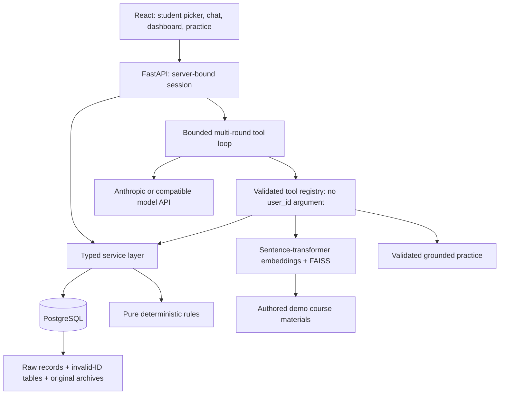

# Architecture and demo assumptions

## Data preservation

| Input | Rows | Destination |
|---|---:|---|
| valid_uuid_engagement.csv | 8,710 | raw_course_engagement + normalized course_progress |
| invalid_uuid_enagagement.csv | 447 | invalid_user_id_engagement |
| valid_uuid_submissions.csv | 17,689 | raw_hackathon_submissions + normalized question_attempts |
| invalid_uuid_submissions.csv | 610 | invalid_user_id_submissions |

All **27,456 rows** are preserved. Original files reconcile with the splits after boolean capitalization normalization (`FALSE` vs `False`). Both original CSVs are additionally stored byte-for-byte as gzip archives in `source_file_archives`, with SHA-256 hashes. Raw tables preserve all original CSV string fields, file names, source row numbers, and issues; duplicate records are not discarded. Invalid UUIDs are quarantined, not declared fraudulent or deleted. They cannot be selected as student sessions.

The source data includes **1,146 empty submission payloads** (1,042 valid-ID and 104 invalid-ID rows). These are retained and marked `missing_payload`, not treated as zero-score attempts. Imported question records expand into topic rows; a multi-topic question counts once in overall history and once for each of its topics.

Import is batched and transactional. Reimport of identical inputs is idempotent; a changed previously imported source fails explicitly rather than overwriting data. Use a separate database or an explicit migration for revised datasets. This importer does not implement ongoing incremental production ingestion. The CSVs and raw database copies contain student records: do not commit them.

## Explicit demo assumptions

- **Full marks:** preserve supplied hackathon `question_score`. Only missing full marks default to 2. Course MCQs assume 2 marks per attempted question, so `score / (attempts × 2) × 100`. No attempts or out-of-range scores produce an unavailable percentage, not an invented zero or clamped result.
- **Scoring:** use weighted `SUM(obtained)/SUM(maximum)`. Include graded pass/fail/partiallyCorrect and explicitly unAttempted questions; exclude underReview and unscorable records. A pending item is not a failed item.
- **Progress:** certificate or legacy completion flags yield 100%. Otherwise use distinct observed activity IDs divided by course activity count as a **demo engagement proxy**, not verified lesson completion. Anonymous views alone do not establish completion.
- **Weak topics:** below 60% of full marks. Course mapping uses exact subject/skill matching, with `English Ability → English` and `Database Management → SQL` as explicit demo aliases. No matching evidence means no recommendation. Several courses can share a subject; this mapping does not prove question membership in a specific course.
- **Assessment rules:** new `demo-{course_id}-foundation`, `advanced`, and `closed` assessment definitions. Foundation requires enrollment and fewer than 3 recorded attempts. Advanced additionally requires 60% demo progress and 60% course MCQ performance. Closed assessments are inactive. Unknown prerequisites are reported as unknown. These are project-authored rules, not supplied institutional policy.
- **Attempt counts:** demo assessment attempts are stored separately and initially zero. Existing hackathon history is grouped by `(hackathon_id, round_id, attempt_id)`; it is never counted against unrelated demo assessments. Taking/submitting a formal assessment is outside this app's scope. Generated practice is saved separately and does not consume formal assessment attempts.
- **Materials:** nine authored demo lessons cover selected Python, SQL/database, aptitude, English, Java, and AI/ML subjects. They link to 107 supplied courses. Other subjects return insufficient information until material is added. These are not original institutional lesson documents.

## Seeded users

Two students have the available course-MCQ scoring records; two appear in both datasets and can demonstrate course progress plus hackathon weakness/history; a fifth has rich hackathon history but missing enrollment data. The selection is deterministic and based on actual data. It does not fabricate prerequisite failures or maximum-attempt history to meet a profile description. Unit fixtures exercise branches absent from real data. `backend/data/dataset_verification.json` records selected IDs and coverage after the dataset rehearsal described in the [README](../README.md#check-the-project).

## Architecture

LLM-visible tool schemas omit `user_id`; the dispatch boundary discards any injected ID and passes session identity. Tools cannot execute arbitrary SQL. Dashboard and chat use the same services. Student switching clears the session conversation. Eligibility and all its inputs bypass the cache. Other deterministic lookups have a bounded 60-second TTL; final natural-language answers are not cached. A Redis-backed session/cache store is the multi-worker upgrade path.

RAG uses normalized embeddings and FAISS inner product (cosine similarity), with a configurable 0.35 threshold. Retrieval is restricted to the requested course when specified. Empty retrieval stops content generation in code. The threshold is a relevance heuristic, not proof of factual entailment. Source IDs are displayed, and generated practice references must match retrieved IDs. Logs in `backend/logs/turns.jsonl` capture chat inputs, tool inputs/outputs, final answers, errors, cache hits, and latency. Logs are local, ignored by Git, and can contain student data. The demo does not yet implement automatic log retention or a robust adversarial content-verification model.

Tabular tool outputs use a lossless compact encoding for model context: shared fields appear once and each row follows an explicit column list. API responses and local traces retain the original objects. Provider throttling receives at most two retries, with at most 15 seconds per wait; longer quota resets return an actionable error.
